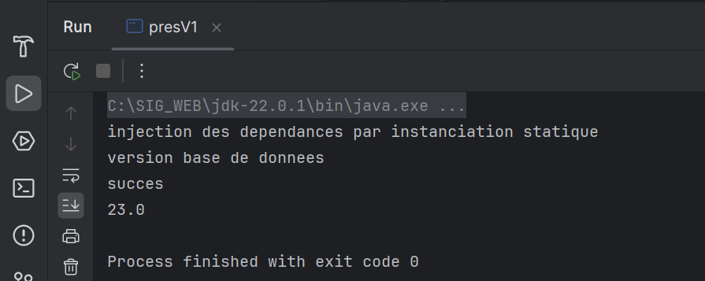
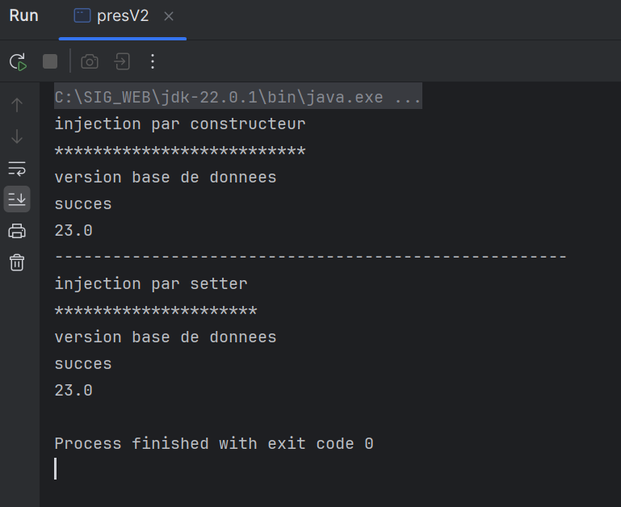
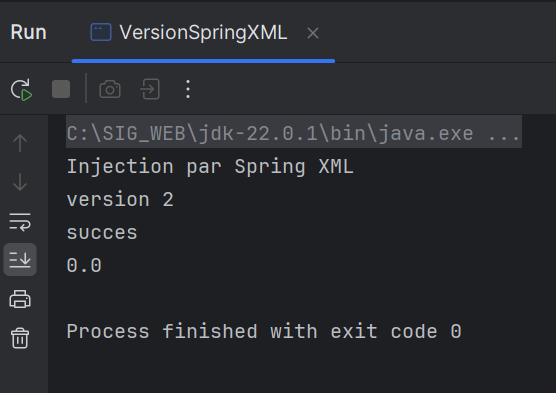
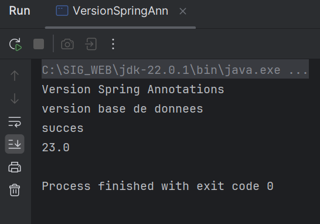

<h2> Inversion de contrôle et injection de dépendances </h2>
<h4>L'inversion de contrôle : </h4><h6>Permet au développeur de se concentrer sur le code metier et sont les framework qui vont s'occuper du code technique</h6>
<h6>L'inversion de contrôle est lui même basé sur un paradigme AOP : programmation orientée aspect qui consiste à séparer le code métier des autres apspects de l'app puis utiliser des tisseurs pour les rassembler </h6>
<h4>L'injection des dépendances :</h4>
<h6> on peut faire l'injection de trois façons :</h6>
<h6>1- Instanciation statique : c'est l'exemple dans la classe presV1
</h6>
<h6>2- Instanciation dynamique : comme dans la classe presV2
</h6>
<h6>3- Instanciation par le framework Spring avec la version XML comme dans la classe VersionSpringXML
</h6>
<h6>Ou bien la version annotations comme dans l'exemple de la classe VersionSprinAnn
</h6>